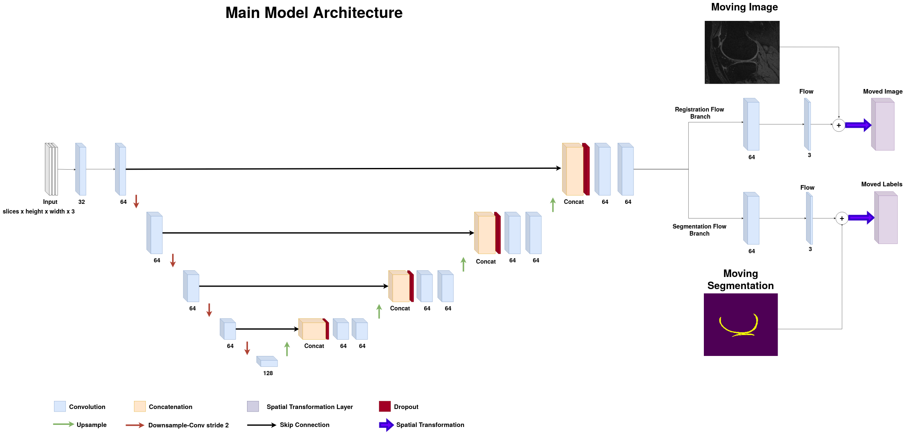
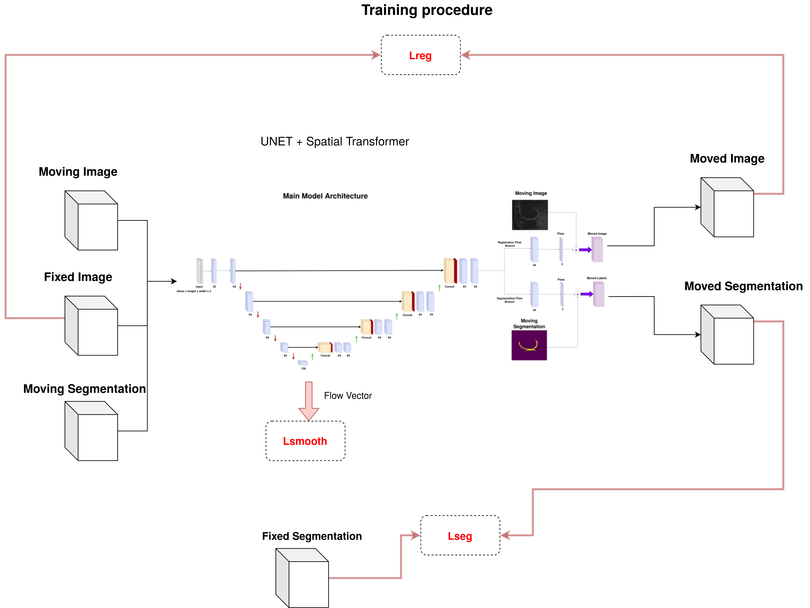
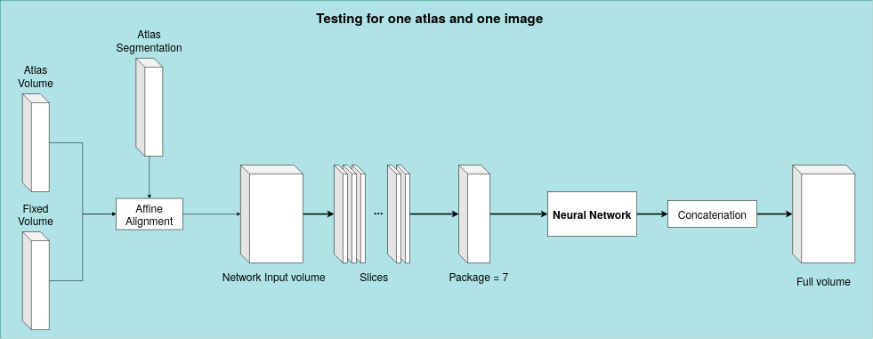
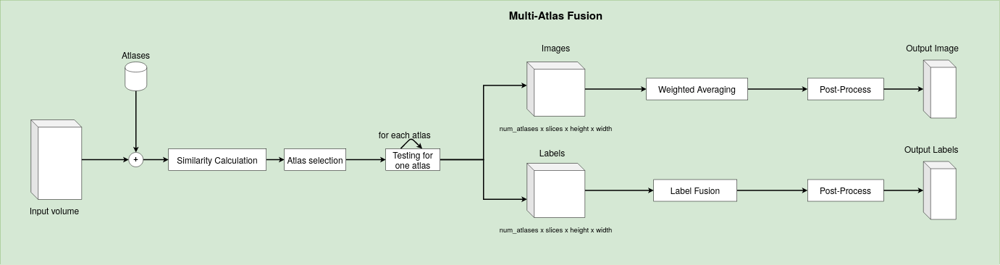

# Deep learning neural networks for the registration and cartilage segmentation of MRI knee images!

This repository contains a basic part of the source code of my Master thesis with title "Deep learning neural networks for the registration and cartilage segmentation of MRI knee images" in Advanced Computer and Communication Systems with specialization field: Intelligent and Autonomous Systems-Computational Intelligence Methodologies and Applications.

## Abstract

Osteoarthritis is a disease that causes pain and difficulty in movement affecting millions of people. The main causes of the disease are aging, injuries and over-weightness (obesity). The number of people that suffer from this disease increases due to the expanding life expectancy as aging causes joint degradation. As a result, it affects people’s quality of life because it constraints them and makes activities like working and physical exercise very difficult to achieve. The most common type of osteoarthritis is the one that concerns the knee. In this case knee joint’s structures are under aggressive degradation. In order to fight the disease the first step is the fast diagnosis combined with thorough check of the knee structures. The cartilages with their characteristics like volume, thickness and the area of their surface are a structure of major importance in the analysis of osteoarthritis. Analysis of the joint is also crucial in the treatment of the patient because it allows monitoring the progress of the disease and adjusting the treatment to the patient’s needs. This is most commonly accomplished with Magnetic Resonance Imaging (MRI) which can  depict the structures of joint with minimum distortion in a non-invasive way. Nowadays MRI is only one type of medical images which are produced. As a result the analysis of these images is very important because it is required in order to extract conclusions over diagnosis, method of treatment and further research. The last few years, apart from classical image processing techniques, deep learning and neural networks are applied while analysing medical images. In particular, in image processing the dominant type of neural networks  are Convolution Neural Networks that uses convolution filters, with learnable parameters produced by an optimization process. The main advantage of these networks is that they can extract high-level features from images. Furthermore, there is a growing interest in three dimensional representations  of volumes of anatomical structures. Because of this, the main concern of the thesis model is the processing/analysis of 3D MRI images. For this reason the most basic step of medical image analysis is the segmentation of the anatomical structures. Manual segmentation of these images is extremely time consuming, labor-intensive and its quality is influenced by external factors such as human fatigue. This thesis presents a fast and automated model in order to extract segmentations. The whole procedure is based in registration of pairs of medical images in order to extract conclusions for the target image. More specifically, U-NET like neural networks are combined with Spatial Transformation Networks to align images with the target image. The result is corrected and enhanced by registering multiple images in the target image and combing their aligned labels. Each voxel’s label is the result of a label fusion algorithm which decides the final labels. The aforementioned procedures are going to become more clear and elaborated in the next chapters in order to present an automated framework for the registration-based segmentation of 3D MRI Images. This framework will be applied in images of knee osteoarthritis and it will be compared with other implementations for the same dataset.

## Main model

### U-NET like architecture of main network
In the next image you can se the main network structure used for the production of flow fields. The input is a 4D array which consists of the Moving Image (slices x height x width), the Fixed/target Image (slices x height x width) and the segmentation map of the Moving Image (slices x height x width x #classes). The first path, called Contraction, is used to capture the context in the image. Afterwards, there is an intermediate layer called bottleneck that connects the previous one with the Expanding path. The second path is used to enable expansion of the feature maps in order get the last feature maps, from which the network will produce the flow fields for Registration and Segmentation. The expanding path is more complex because it is more difficult to reconstruct the field. In the end of the main U-NET architecture there are 2 extra convolution layers that learns to produce the flow fields and 2 Spatial Transformation Networks (STN) as implemented in the Voxelmorph Reference. The STN layers take the feature maps and the Moving Images (or Segmentation) and produce the transformed feature map according to the flow field in their input.

### Training procedure
The network has three outputs: the Moved (Transformed) Image, the Moved Segmentation map and the Flow field. In order to train the network keras framework needs to define for each output a loss function that will be part of a weighted sum of the final loss function. 
- First, a variant of mutual information with a negative sign is used as the loss function for the Registration. The MI is computed between the Moved Image and the Fixed/Target Image. 

- The second term is a Regularization term from *. This term encourage the network to produce smooth deformations with less holes inside the anatomical structures.

where 

- The third term is a metric which indicates the amount of overlap between the ground truth segmentation map of the fixed image and the segmentation map produced by the network. For this purpose a weighted average dice is used. Simple dice: 

Final Loss Function: 

*G. Balakrishnan, A. Zhao, M. R. Sabuncu, J. Guttag, and A. V. Dalca, “Voxelmorph: A learning framework for deformable medical image registration”,
IEEE Transactions on Medical Imaging, vol. 38, no. 8, 1788–1800, 2019, ISSN:
1558-254X. DOI: 10.1109/tmi.2019.2897538. [Online]. Available: http:
//dx.doi.org/10.1109/TMI.2019.2897538

### Testing framework for Single Atlas usage
At first, a data generator supplies the network with packages of slices, as declared in variable "window". Every package goes through the network and the middle slice of each one is maintained in order to get the full volume and segmentation in the output. In the first image we can see an example of a package inserted in the network. The data generator can also affinely align the pair of volumes before the insertion to the network. For example, if we have a volume with 125 slices then 125 packages will be passed from the network to get the final output by concatenating the central slices of them.

### Multi-Atlas framework with label fusion
The model described above is used in a more complete framework which is referred as Multi- Atlas framework. In this procedure, for every example of the test set, a particular number of images from the training set are chosen in order to be used as an Atlas (moving image) for the network. Two techniques are used for the selection of the most suitable atlases and they will be described in the next section.  In the framework, in order to get the registration and segmentation of a test image (declared as fixed/target image), pairs of the fixed image and every atlas (declared as moving image) are generated and inserted in the network. The output of the network for each pair is preserved. These outputs are concatenated in a 4d volume (#atlases,#slices,height,width) and it's segmentation map. After that, the 4d volume of the images moves through a weighted average ( weight = similarity(fixed,atlas)) 
 and results in the moved image and the 4d volume of the segmentation maps goes through a label fusion algorithm like majority voting, weighted averaging or S.T.A.P.L.E . STAPLE resulted in better accuracy in the conducted experiments. This techniques exploits the fact that the network can produce the registered image and the transformed segmentation (target segmentation) very fast, because if the network is trained, the results are produced with a simple forward evaluation. By using multi atlas procedure the model can cover more efficiently the variance of the deformations and anatomical structures in the dataset.

### Atlases Selection
In order for the framework to be efficient and fast we need to select the most suitable atlases (template images) for each test image. The basic concept is that similar images can be aligned more easily. So the first option is to calculate a similarity metric between the test image and every image of the training set. This similarity metric can be the MSE, NCC or the Mutual Information which is non-linear and matched with the loss function.
#### A more explicit metric for atlases selection
A second approach uses the deformation fields to calculate the similarity between the test image and the candidate images. The concept is that when the required deformation field is small, the registration is more probable to be successful. So we need to measure the norm of the deformation field  . But this straight calculation will need to execute the network for all the training images which is very time consuming and inefficient. A way to mitigate this is to make the approximation below. 

Where M is an average image of the training dataset (can be produced by a simple average or by a groupwise registration), α is the current atlas and x is the test image.
The first term  is the deformation field produced by the network when the pairs (train image, average M) are inserted as inputs. These are calculated in a predefined time and they are stored in the drive. And the second term F_{M\rightarrow{}x} is calculated during testing time. With this procedure only one extra calculation is needed at testing time and because we measure the difference from an image lying in the center of the space, the approximation has small error.
After all distances of flow fields between test image and the training images (atlases candidates) are computed, the framework chooses as atlases the images with the smallest distances. This concept is introduced in the article (Using manifold learning for atlas selection in multi-atlas segmentation) mentioned in the references. The usage of it in this framework was motivated by the fact that the network can produce fast deformation fields which are required by the above metric. Due to this, flow field distance is a measure in perfect harmony with the main model.

### Local Learning
In this section, an additional module of local learning is described. With the network weights initialized with the parameters obtained by the global training, at testing time we give pairs of (test image,selected atlas) or (selected atlas1,selected atlas2) in the network in order to train it in the subspace of the current test image. This procedure is based in the concept that selected atlases are images similar to the target image so by local training the network for this neighborhood we adapt the model from the global space to a smaller space near the target image. Code for local learning is also provided in the framework.

## Experimental Results
#### Binary (Background - Cartilages)
| Model                                          |                     |                 |                |                |                           |
|:-----------------------------------------------|:--------------------|:----------------|:---------------|:---------------|:--------------------------|
|                                                | Dice Seg Cartilages | VOE             | VD             | ASSD           | \|Jacobian\| (Negative %) |
| Affine                                         | 0.2631 (0.0017)     | 84.157 (8.956)  | 1.599 (17.662) | 3.988 (2.431)  | \-                        |
| Single-Atlas model                             | 0.79 (0.081)        | 34.121 (9.010)  | -4.642 (16.16) | 0.729 (0.108)  | 0.031 (0.007)             |
| **Multi-Atlas model (9-NMI)**                  | **0.8296 (0.0278)** | 29.025 (3.962)  | 10.183 (9.640) | 0.655 (0.122)  | 0.034 (0.009)             |
| Multi-Atlas model (12-NMI)                     | 0.8295 (0.0275)     | 29.039 (3.919)  | 11.136 (9.883) | 0.618 (0.042)  | 0.037 (0.006)             |
| Multi-Atlas model (12-Flow dist)               | 0.8293 (0.0287)     | 29.062 (4.050)  | 11.869 (9.968) | 0.659 (0.0117) | 0.044 (0.005)             |
| **Multi-Atlas model (9-NMI) + Local Learning** | **0.8351 (0.0278)** | 28.407 (4.233)  | 8.026 (11.042) | 0.639 (0.099)  | 0.075 (0.017)             |
| Multi-Atlas Less data (N=10)                   | 0.8053 (0.0341)     | 32.456 (4.636)  | 9.975 (10.840) | 0.814 (0.231)  | 0.04 (0.005)              |
| Ref\[1\] (Av. cart)                            | 0.8775 (0.0407)     | 21.5 (6.345)    | 1.25 (8.895)   | 0.195 (0.095)  | \-                        |
| Ref\[2\] (N=10)                                | 0.8119 (3.47)       | \-              | \-             | \-             | \-                        |
| Ref\[2\] - Mononetworks N=200                  | 0.8354 (0.293)      | \-              | \-             | \-             | \-                        |
| ANTS                                           | 0.6959 (0.15)       | 45.026 (14.018) | 5.271 (16.508) | 1.231 (1.033)  | \-                        |

#### Multi Class (Background, Bones, Cartilages)
| Model                       |                 |                     |
|:----------------------------|:----------------|:--------------------|
|                             | Dice Bones      | Dice Seg Cartilages |
| Multi Atlas model (9 atlases)       | 0.9370 (0.0228) | 0.8083 (0.0759)     |
| Multi Atlas model (9 atlases) 2nd   | 0.9206 (0.0055) | 0.8232 (0.0254)     |
| Ref\[1\] (Av.)              | 0.985 (0.0313)  | 0.8775 (0.0407)     |
| Ref\[2\] Mononetworks N=200 | 0.9824 (0.0034) | 0.8354 (0.293)      |
| Ref\[2\] (N=10)             | 0.9770(0.0065)  | 0.8119 (0.347)      |

N: Size of training set

## Files

Files can be provided upon request at tpvagenas@gmail.com .

## Libraries
scipy,
numpy,
matplotlib,
random,
itertools,
tensorflow,
keras,
SimpleITK
pynd,
Slicer,
ANTS

OAI DATASET https://www.nia.nih.gov/research/resource/osteoarthritis-initiative-oai

## References

Ambellan, Felix, Alexander Tack, Moritz Ehlke, and Stefan Zachow. 2018. “Automated Segmentation of Knee Bone and Cartilage Combining Statistical Shape Knowledge and Convolutional Neural Networks: Data from the Osteoarthritis Initiative.” _Medical Image Analysis_. [https://doi.org/10.1016/j.media.2018.11.009](https://doi.org/10.1016/j.media.2018.11.009).

Argyriou, Vasileios, Jesus Martinez Del Rincon, Barbara Villarini, and Alexis Roche. 2015. _Image, Video and 3D Data Registration: Medical, Satellite and Video Processing Applications with Quality Metrics_. 1st ed. Wiley Publishing.

Avants, Brian, Nick Tustison, and Gang Song. 2008. “Advanced Normalization Tools (Ants).” _Insight J_ 1–35 (November).

Balakrishnan, Guha, Amy Zhao, Mert R. Sabuncu, John Guttag, and Adrian V. Dalca. 2019. “VoxelMorph: A Learning Framework for Deformable Medical Image Registration.” _IEEE Transactions on Medical Imaging_ 38 (8): 1788–1800. [https://doi.org/10.1109/tmi.2019.2897538](https://doi.org/10.1109/tmi.2019.2897538).

Bankman, Isaac N. 2009. _Handbook of Medical Image Processing and Analysis_. Elsevier Inc. [https://doi.org/10.1016/B978-0-12-373904-9.X0001-4](https://doi.org/10.1016/B978-0-12-373904-9.X0001-4).

Beare, Richard, Bradley Lowekamp, and Ziv Yaniv. 2018. “Image Segmentation, Registration and Characterization in R with Simpleitk.” _Journal of Statistical Software, Articles_ 86 (8): 1–35. [https://doi.org/10.18637/jss.v086.i08](https://doi.org/10.18637/jss.v086.i08).

Burger, Wilhelm, and Mark James Burge. 2009. _Principles of Digital Image Processing - Fundamental Techniques_. Undergraduate Topics in Computer Science. Springer. [https://doi.org/10.1007/978-1-84800-191-6](https://doi.org/10.1007/978-1-84800-191-6).

Crum, William, Thomas Hartkens, and Derek Hill. 2004. “Non-Rigid Image Registration: Theory and Practice.” _The British Journal of Radiology_ 77 Spec No 2 (February): S140–53. [https://doi.org/10.1259/bjr/25329214](https://doi.org/10.1259/bjr/25329214).

Dalca, Adrian V., Guha Balakrishnan, John V. Guttag, and Mert R. Sabuncu. 2018. “Unsupervised Learning for Fast Probabilistic Diffeomorphic Registration.” _CoRR_. [http://arxiv.org/abs/1805.04605](http://arxiv.org/abs/1805.04605).

Ginneken, Bram Van, Tobias Heimann, and Martin Styner. n.d. “M.: 3D Segmentation in the Clinic: A Grand Challenge.” In _In: MICCAI Workshop on 3D Segmentation in the Clinic: A Grand Challenge. (2007_.

Gonzalez, Rafael C., and Richard E. Woods. 2001. _Digital Image Processing_. 2nd ed. USA: Addison-Wesley Longman Publishing Co., Inc.

Goodfellow, Ian, Yoshua Bengio, and Aaron Courville. 2016. _Deep Learning_. MIT Press.

Goshtasby, A. Ardeshir. 2012. _Image Registration: Principles, Tools and Methods_. Springer Publishing Company, Incorporated.

Guo, Courtney K. 2019. “Multi-Modal Image Registration with Unsupervised Deep Learning.” [https://dspace.mit.edu/handle/1721.1/123142](https://dspace.mit.edu/handle/1721.1/123142).

Hajnal, Joseph, Derek Hill, and D. J. Hawkes. 2001. _Medical Image Registration_. _Medical Image Registration_.

Haykin, Simon. 2007. _Neural Networks: A Comprehensive Foundation (3rd Edition)_. USA: Prentice-Hall, Inc.

Health, National Institutes of. n.d. “Osteoarthritis Initiative.” [https://nda.nih.gov/oai/](https://nda.nih.gov/oai/).

Hill, Derek L. G., Philip G. Batchelor, Mac Holden, and David J. Hawkes. 2001. “Medical Image Registration.” _Physics in Medicine and Biology_ 46 3: R1–45.

Hoang Duc, Albert, Marc Modat, Kelvin Leung, Manuel Jorge Cardoso, Josephine Barnes, Timor Kadir, and Sébastien Ourselin. 2013. “Using Manifold Learning for Atlas Selection in Multi-Atlas Segmentation.” _PLoS ONE_ 8 (August): 70059. [https://doi.org/10.1371/journal.pone.0070059](https://doi.org/10.1371/journal.pone.0070059).

Iglesias, Juan Eugenio, and Mert R. Sabuncu. 2015a. “Multi-Atlas Segmentation of Biomedical Images: A Survey.” _Medical Image Analysis_ 24 (1): 205–19. [https://doi.org/https://doi.org/10.1016/j.media.2015.06.012](https://doi.org/https://doi.org/10.1016/j.media.2015.06.012).

———. 2015b. “Multi-Atlas Segmentation of Biomedical Images: A Survey.” _Medical Image Analysis_ 24 (1): 205–19. [https://doi.org/https://doi.org/10.1016/j.media.2015.06.012](https://doi.org/https://doi.org/10.1016/j.media.2015.06.012).

Jaderberg, Max, Karen Simonyan, Andrew Zisserman, and Koray Kavukcuoglu. 2015. “Spatial Transformer Networks.” _CoRR_ abs/1506.02025. [http://arxiv.org/abs/1506.02025](http://arxiv.org/abs/1506.02025).

Le, Hung, and Ali Borji. 2017. “What Are the Receptive, Effective Receptive, and Projective Fields of Neurons in Convolutional Neural Networks?” _CoRR_. [http://arxiv.org/abs/1705.07049](http://arxiv.org/abs/1705.07049).

Leica, Andrei, Mihai Voicescu, Răzvan-Ştefan Brînzea, and Costin-Anton Boiangiu. 2018. “FULLY Convolutional Neural Networks for Image Segmentation,” December.

Litjens, Geert, Thijs Kooi, Babak Ehteshami Bejnordi, Arnaud Arindra Adiyoso Setio, Francesco Ciompi, Mohsen Ghafoorian, Jeroen A. W. M. van der Laak, Bram van Ginneken, and Clara I. Sánchez. 2017. “A Survey on Deep Learning in Medical Image Analysis.” _Medical Image Analysis_ 42: 60–88. [https://doi.org/https://doi.org/10.1016/j.media.2017.07.005](https://doi.org/https://doi.org/10.1016/j.media.2017.07.005).

Luo, Wenjie, Yujia Li, Raquel Urtasun, and Richard Zemel. 2017. “Understanding the Effective Receptive Field in Deep Convolutional Neural Networks,” January.

Maier, Andreas K., Christopher Syben, Tobias Lasser, and Christian Riess. 2018. “A Gentle Introduction to Deep Learning in Medical Image Processing.” _CoRR_ abs/1810.05401. [http://arxiv.org/abs/1810.05401](http://arxiv.org/abs/1810.05401).

Marčan, Marija, Denis Pavliha, Maja Music, Igor Fučkan, Ratko Magjarevic, and Damijan Miklavcic. 2014. “Segmentation of Hepatic Vessels from Mri Images for Planning of Electroporation- Based Treatments in the Liver.” _Radiology and Oncology_ 48 (April). [https://doi.org/10.2478/raon-2014-0022](https://doi.org/10.2478/raon-2014-0022).

Paragios, Nikos. 2012. “Deformable Image Registration : A Survey Aristeidis Sotiras.” In.

Pelletier, Charlotte, Geoffrey Webb, and François Petitjean. 2019. “Temporal Convolutional Neural Network for the Classification of Satellite Image Time Series.” _Remote Sensing_ 11 (March): 523. [https://doi.org/10.3390/rs11050523](https://doi.org/10.3390/rs11050523).

Rohlfing, Torsten, Robert Brandt, Randolf Menzel, Daniel Russakoff, Calvin Maurer, and Evangelia Micheli-Tzanakou. 2007. “Quo Vadis , Atlas-Based Segmentation?” In _Handbook of Biomedical Image Analysis_, 435–86. [https://doi.org/10.1007/0-306-48608-3_11](https://doi.org/10.1007/0-306-48608-3_11).

Ronneberger, Olaf, Philipp Fischer, and Thomas Brox. 2015. “U-Net: Convolutional Networks for Biomedical Image Segmentation.” In _Medical Image Computing and Computer-Assisted Intervention – Miccai 2015_, edited by Nassir Navab, Joachim Hornegger, William M. Wells, and Alejandro F. Frangi, 234–41. Cham: Springer International Publishing.

Shen, Dinggang, Guorong Wu, and Heung-Il Suk. 2017. “Deep Learning in Medical Image Analysis.” _Annual Review of Biomedical Engineering_ 19 (1): 221–48. [https://doi.org/10.1146/annurev-bioeng-071516-044442](https://doi.org/10.1146/annurev-bioeng-071516-044442).

Shrestha, Ajay, and Ausif Mahmood. 2019. “Review of Deep Learning Algorithms and Architectures.” _IEEE Access_ 7: 53040–65.

SimpleElastix. n.d. “Groupwise Registration.” [https://simpleelastix.readthedocs.io/GroupwiseRegistration.html](https://simpleelastix.readthedocs.io/GroupwiseRegistration.html).

Sonka, Milan, J. Fitzpatrick, and Barry Masters. 2002. “Handbook of Medical Imaging, Volume 2: Medical Image Processing and Analysis.” _Optics & Photonics News - OPT PHOTONICS NEWS_ 13 (January): 50–51. [https://doi.org/10.1117/3.831079](https://doi.org/10.1117/3.831079).

Suri, Jasjit S., and Aly Farag. 2007. _Deformable Models: Biomedical and Clinical Applications (Topics in Biomedical Engineering. International Book Series)_. Berlin, Heidelberg: Springer-Verlag.

Tack, Alexander, Anirban Mukhopadhyay, and Stefan Zachow. 2018. “Knee Menisci Segmentation Using Convolutional Neural Networks: Data from the Osteoarthritis Initiative.” _Osteoarthritis and Cartilage_ 26 (March). [https://doi.org/10.1016/j.joca.2018.02.907](https://doi.org/10.1016/j.joca.2018.02.907).

Wang, Hongzhi, Jung W Suh, Sandhitsu R Das, John B Pluta, Caryne Craige, and Paul A Yushkevich. 2013. “Multi-Atlas Segmentation with Joint Label Fusion.” _IEEE Transactions on Pattern Analysis and Machine Intelligence_ 35 (3): 611—623. [https://doi.org/10.1109/TPAMI.2012.143](https://doi.org/10.1109/TPAMI.2012.143).

Warfield, Simon K., Kelly H. Zou, and William M. Wells. 2002. “Validation of Image Segmentation and Expert Quality with an Expectation-Maximization Algorithm.” In _Medical Image Computing and Computer-Assisted Intervention — Miccai 2002_, edited by Takeyoshi Dohi and Ron Kikinis, 298–306. Berlin, Heidelberg: Springer Berlin Heidelberg.

Warfield, Simon, Kelly Zou, and William Wells. 2004. “Simultaneous Truth and Performance Level Estimation (Staple): An Algorithm for the Validation of Image Segmentation.” _IEEE Transactions on Medical Imaging_ 23 (August): 903–21. [https://doi.org/10.1109/TMI.2004.828354](https://doi.org/10.1109/TMI.2004.828354).

Xu, Zhenlin, and Marc Niethammer. 2019. “DeepAtlas: Joint Semi-Supervised Learning of Image Registration and Segmentation.” _CoRR_ abs/1904.08465. [http://arxiv.org/abs/1904.08465](http://arxiv.org/abs/1904.08465).

Yeghiazaryan, Varduhi, and Irina Voiculescu. 2015. “An Overview of Current Evaluation Methods Used in Medical Image Segmentation.” RR-15-08. Oxford, UK: Department of Computer Science.

Zitová, Barbara, and Jan Flusser. 2003. “Image Registration Methods: A Survey.” _Image and Vision Computing_ 21 (October): 977–1000. [https://doi.org/10.1016/S0262-8856(03)00137-9](https://doi.org/10.1016/S0262-8856(03)00137-9).

Zou, Kelly, Simon Warfield, Aditya Bharatha, Clare Tempany, Michael Kaus, Steven Haker, William Wells, Ferenc Jolesz, and Ron Kikinis. 2004. “Statistical Validation of Image Segmentation Quality Based on a Spatial Overlap Index.” _Academic Radiology_ 11 (February): 178–89. [https://doi.org/10.1016/S1076-6332(03)00671-8](https://doi.org/10.1016/S1076-6332(03)00671-8).

